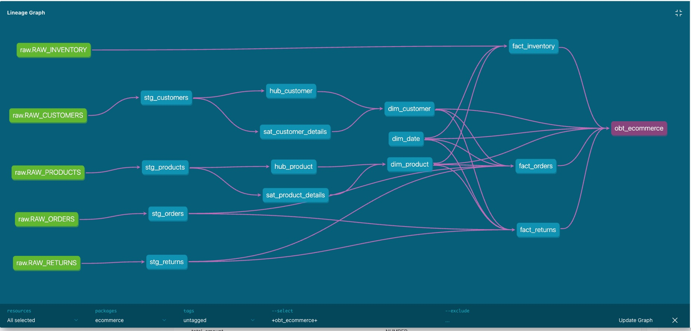

## dbt implementation

This dbt project transforms raw VARIANT JSON from Snowflake into analytics-ready tables through a four-layer medallion architecture. The modeling approach progresses from simple cleaning (staging) through auditable history (Data Vault 2.0) to consumer-facing analytics (star schema + OBT).


## Lineage (dbt docs)


## Model Inventory

### Staging (models/staging/) — Materialized as views

Each staging model reads from a single RAW source table, extracts fields from Snowflake VARIANT JSON using path notation (RAW_DATA:field::TYPE), and deduplicates using ROW_NUMBER() OVER (PARTITION BY pk ORDER BY INGESTED_AT DESC).

### Vault (models/vault/) — Materialized as incremental tables

Implements Data Vault 2.0 with MD5 hash keys. Each model uses is_incremental() to insert only new records on subsequent runs.

| Model | Type | Purpose |
|---|---|---|
| `hub_product` | Hub | Isolates product business key with load-date lineage |
| `hub_customer` | Hub | Isolates customer business key |
| `hub_order` | Hub | Isolates order business key (UUID) |
| `sat_product_details` | Satellite | Tracks product attribute changes via HASH_DIFF on name + price + stock |
| `sat_customer_details` | Satellite | Tracks customer attribute changes via HASH_DIFF on email + phone + address |
| `lnk_order_product` | Link | Captures the order-to-product relationship as a composite hash key |

**Change detection:** Satellites use MD5(CONCAT(...)) as a HASH_DIFF column. On incremental runs, only records whose HASH_DIFF doesn't match any current (non-end-dated) satellite row are inserted. This means the vault accumulates a complete change history without duplicating unchanged records.

### Snapshots (snapshots/) — SCD Type 2

dbt automatically manages `DBT_VALID_FROM`, `DBT_VALID_TO`, `DBT_SCD_ID`, and `DBT_UPDATED_AT` columns. When a tracked column changes, the previous row gets an end-date and a new row is inserted with `DBT_VALID_TO = NULL` (current record).

### Marts (`models/marts/`) — Materialized as tables

| Model | Grain | Description |
|---|---|---|
| `dim_customer` | 1 row per customer | Current-state customer attributes from hub + satellite (where `END_DATE IS NULL`) |
| `dim_product` | 1 row per product | Current-state product attributes from hub + satellite |
| `dim_date` | 1 row per calendar day | Generated date spine from 2020–2030 with day/week/month/quarter attributes |
| `fact_orders` | 1 row per order | Order metrics with surrogate key joins to all dimensions + return flag |
| `fact_returns` | 1 row per return | Return details with reason flags and dimension key joins |
| `fact_inventory` | 1 row per snapshot | Point-in-time stock levels with out-of-stock / low-stock derivations |
| `obt_ecommerce` | 1 row per order | Wide denormalized table — see section below |

## Commands

```bash
cd include/ecommerce

# Verify Snowflake connectivity
dbt debug

# Run layers in dependency order
dbt run --select staging
dbt run --select vault
dbt snapshot
dbt run --select marts

# Run everything (dbt resolves order automatically)
dbt run

# Test
dbt test                        # all tests
dbt test --select staging       # layer-specific

# Always clear target/ after schema.yml changes
rm -rf target/

# Documentation
dbt docs generate && dbt docs serve
```
