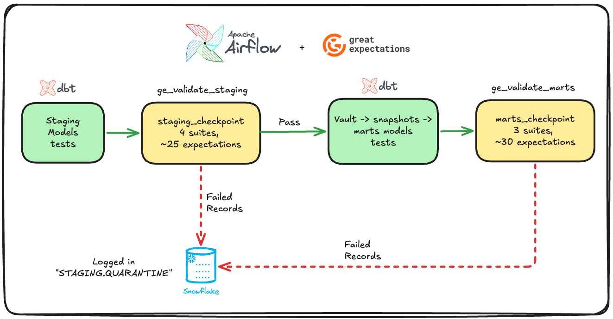

# Great Expectations — Data Quality Framework

This module implements data quality validation across the pipeline using Great Expectations 1.3.x. It defines 7 expectation suites covering staging and marts layers, runs them as Airflow tasks between dbt model groups, and routes failures to a Snowflake quarantine table.

## How It Fits Into the Pipeline



Great Expectations checkpoints are embedded directly into the Airflow transform DAG as `PythonOperator` tasks. They sit between dbt task groups — staging validation runs after staging models complete but before vault models begin, and marts validation runs after all marts models are built.

## Checkpoint Architecture

| Checkpoint | Suites | Validates |
|---|---|---|
| `staging_checkpoint` | `stg_products_suite`, `stg_orders_suite`, `stg_customers_suite`, `stg_returns_suite` | Data shape, freshness, distributions after initial transformation |
| `marts_checkpoint` | `fact_orders_suite`, `fact_returns_suite`, `obt_ecommerce_suite` | Referential integrity, business logic, analytical correctness |


## Setup and Data Docs

```bash
cd include/great_expectations

# Run setup — registers datasources, suites, checkpoints
python ge_setup.py
# Automatically opens Data Docs in your browser

# Rebuild Data Docs manually (from project root)
./build_docs.sh
# Serves at http://localhost:8081
```

## File Structure

```
include/great_expectations/
├── ge_setup.py                              # All suite + checkpoint definitions
├── gx/
│   ├── checkpoints/
│   │   ├── staging_checkpoint.json          # References 4 staging validations
│   │   └── marts_checkpoint.json            # References 3 marts validations
│   ├── expectations/                        # Auto-generated suite JSON files
│   ├── validation_definitions/              # Auto-generated validation configs
│   └── .gitignore                           # Excludes uncommitted/ (data docs, credentials)
└── README.md                                # This file

include/quarantine_utils.py                  # Shared utility for writing failures to Snowflake
```
